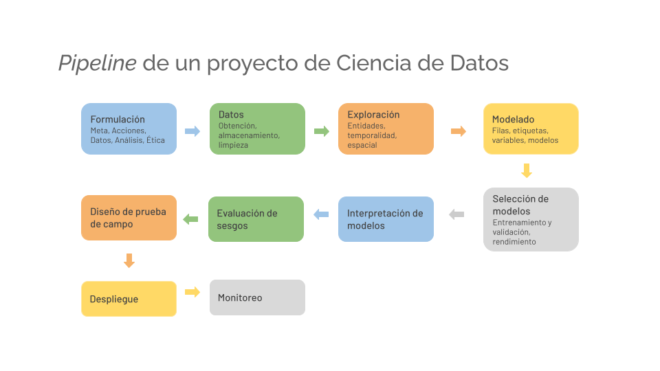

## 1.1 Programación para ciencia de datos

### Motivación

Como científicos de datos diseñamos, construimos y desarrollamos **productos de datos**: sistemas que utilizan información existente y se integran en el contexto específico de las organizaciones para apoyar a los tomadores de decisiones. Estos productos están diseñados para colocar información clave de manera **oportuna**, **confiable** y **accionable**.

- Resuelven problemas específicos.
- Están basados en datos.
- Tienen un impacto directo en la política pública.

A lo largo de todas las etapas del diseño de un producto de datos, es fundamental conocer las herramientas que nos permiten ser más eficientes en el manejo, transformación y análisis de la información.




### ¿Qué significa programar?

> Programar es hablar con las computadoras, decirles qué quieres que hagan, no sólo una vez, sino de formas que persistan; que puedan variar como el lenguaje humano, con una estructura repetible pero con distintos verbos y objetos.  
> — *Tim O'Reilly (2021)*


Entonces, programar consiste en escribir instrucciones que una computadora puede ejecutar para realizar una tarea.

En ciencia de datos, estas instrucciones pueden utilizarse para:

* descargar datos;
* limpiar y transformar información;
* consultar bases de datos;
* automatizar procesos;
* construir modelos;
* producir tablas y visualizaciones;
* generar reportes;
* evaluar políticas públicas.

Por ejemplo, un programa puede contener instrucciones para leer una base de datos y calcular el promedio de una variable:

```python
import pandas as pd

df = pd.read_csv("datos.csv")

print(df["ingreso"].mean())
```


Para que este código se ejecute correctamente, necesitamos un **entorno de programación**.


## 1.2 El entorno de programación

Un entorno de programación es el conjunto de herramientas y configuraciones que necesitamos para escribir, ejecutar y trabajar con código en una computadora.

> El entorno de programación es todo lo que necesitamos alrededor del código para que éste pueda ejecutarse correctamente en nuestra computadora.

Cuando ejecutamos código intervienen diferentes componentes, una representación muy simplificada es:

```text
Computadora
│
├── Sistema operativo
│
├── Sistema de archivos
│
├── Terminal / Shell
│
├── Lenguajes e intérpretes
│   └── Python
│
├── Herramientas
│   └── Git
│
├── Editor de código
│   └── VS Code
│
└── Proyecto
    ├── código
    ├── datos
    ├── dependencias
    └── configuración
```

Durante el curso aprenderemos a interactuar con varias de estas capas.

El objetivo no es convertirnos en especialistas en administración de sistemas, sino entender lo suficiente sobre nuestro entorno para poder:

* ejecutar código;
* identificar errores;
* trabajar de forma reproducible;
* colaborar con otras personas;


## 1.3 Sistema operativo

El **sistema operativo** es el software principal que administra los recursos de una computadora.

Los clásicos son Windows, macOS y Linux. El sistema operativo administra, entre otras cosas:

* archivos;
* memoria;
* programas;
* procesos;
* dispositivos;
* permisos.

Aunque Python funciona en los tres sistemas operativos, existen diferencias importantes en la manera de interactuar con ellos.

> En este curso buscaremos trabajar con un entorno similar a Linux.

#### macOS y Linux

Linux y macOS pertenecen al mundo “Unix-like”: comparten una forma similar de organizar el sistema, trabajar con archivos, procesos y terminales. Por eso muchos comandos funcionan casi igual en ambos.

#### Windows

Windows por otro lado, ha estado más orientado al uso mediante interfaz gráfica, teniendo una arquitectura distinta. Durante el curso  utilizaremos **WSL2 (Windows Subsystem for Linux)** que permite ejecutar un entorno Linux dentro de Windows.

```
macOS ─────┐
           ├── entorno tipo Unix
Linux ─────┘

Windows ───── arquitectura distinta
   │
   └── WSL → entorno Linux dentro de Windows
```

## 1.4 Sistema de archivos

El **sistema de archivos** organiza la información almacenada en nuestra computadora.

Los principales elementos son:

* archivos;
* directorios o carpetas;
* rutas.

Por ejemplo:

```text
proyecto/
│
├── data/
│   └── encuesta.csv
│
├── scripts/
│   └── analisis.py
│
└── README.md
```

Aquí `proyecto` contiene dos directorios y un archivo.

### Rutas

Una ruta indica la ubicación de un archivo o directorio.

Por ejemplo:

```text
proyecto/data/encuesta.csv
```

Durante el curso utilizaremos continuamente rutas para indicar dónde se encuentran:

* bases de datos;
* scripts;
* configuraciones;
* resultados.

Más adelante distinguiremos entre:

* rutas absolutas;
* rutas relativas.


## 1.5 Terminal y sheel

La **terminal** es una interfaz que nos permite interactuar con la computadora utilizando texto.

En lugar de abrir una carpeta haciendo clic, podemos escribir:

```bash
cd proyecto
```

En lugar de crear una carpeta desde una interfaz gráfica, podemos escribir:

```bash
mkdir data
```

La terminal será una herramienta central durante el curso.

Nos permitirá:

* navegar entre archivos;
* ejecutar programas;
* utilizar Git;
* instalar herramientas;
* administrar ambientes;
* ejecutar scripts;
* trabajar con Docker;
* interactuar con servidores;
* supervisar acciones realizadas por agentes.

Aunque frecuentemente utilizamos Terminal y sheel como sinónimos, conceptualmente son diferentes.

- La **terminal** es la interfaz donde escribimos comandos.

- La **shell** es el programa que interpreta esos comandos.

Algunas shells comunes son:

* `bash`;
* `zsh`;
* `fish`;
* PowerShell.

Por ejemplo, al escribir:

```bash
pwd
```

la shell interpreta el comando y solicita al sistema operativo mostrar el directorio en el que nos encontramos.


## 1.6 Programas e intérpretes

[](https://www.python.org/psf/about/)

Python es un **lenguaje de programación**, pero para ejecutar código necesitamos tener instalado un programa capaz de interpretarlo, o sea Python. 

En este sentido: Python es tanto el nombre del lenguaje como el nombre del programa que usamos para ejecutar código escrito en ese lenguaje.

Podemos verificar si Python se encuentra disponible escribiendo:

```bash
python --version
```

o, dependiendo del sistema:

```bash
python3 --version
```


## 1.7 Herramientas: Git


Git es un sistema de **control de versiones**. Nos permite registrar los cambios que hacemos en un proyecto.

Conceptualmente:

```text
Proyecto
│
├── versión 1
│
├── versión 2
│
├── versión 3
│
└── versión actual
```

Con Git podemos:

* conocer qué archivos cambiaron;
* revisar exactamente qué cambió;
* regresar a una versión anterior;
* trabajar con otras personas;
* experimentar sin destruir una versión funcional del proyecto.

Más adelante utilizaremos Git de manera intensiva.

Por ahora únicamente verificaremos que se encuentre instalado:

```bash
git --version
```


## 1.8 ¿Qué es un proyecto reproducible?

Uno de los conceptos centrales del curso será la **reproducibilidad**.

Supongamos que realizamos un análisis para evaluar una política pública.

Tenemos:

```text
datos
  +
código
  +
dependencias
  +
configuración
  ↓
resultados
```

Un análisis es reproducible cuando otra persona puede utilizar esos elementos y obtener los mismos resultados.

No basta con enviar:

```text
analisis_final_v7_ahora_si_final.ipynb
```

También necesitamos conocer:

* qué datos se utilizaron;
* qué versión del código;
* qué paquetes fueron necesarios;
* qué versiones de esos paquetes;
* cómo se configuró el entorno;
* qué pasos produjeron los resultados.

Durante el curso iremos incorporando herramientas para resolver cada una de estas preguntas.


## 1.9 ¿Por qué importa la reproducibilidad?

Los análisis utilizados pueden servir para:

* describir un problema;
* asignar recursos;
* identificar población beneficiaria;
* evaluar programas;
* producir indicadores;
* desarrollar modelos predictivos;
* informar decisiones públicas.

Por ello, resulta importante poder responder preguntas como:

* ¿de dónde vienen los datos?;
* ¿qué transformaciones se realizaron?;
* ¿qué código produjo una cifra?;
* ¿qué versión del análisis se utilizó?;
* ¿podemos volver a ejecutar el análisis?;
* ¿otra persona podría auditarlo?;
* ¿podemos actualizarlo cuando lleguen nuevos datos?

La reproducibilidad no es únicamente un problema técnico.

También está relacionada con:

* transparencia;
* trazabilidad;
* colaboración;
* mantenimiento;
* auditoría.

## 1.10 Wrap up

A lo largo del curso construiremos progresivamente un proyecto que puede verse de esta forma:

```text
Proyecto de ciencia de datos
│
├── datos
│
├── código
│
├── base de datos
│
├── dependencias
│
├── configuración
│
├── credenciales
│
├── documentación
│
├── pruebas
│
└── resultados
        │
        ▼
   reproducibilidad
```

Sobre esta estructura iremos incorporando herramientas como:

```text
Bash
Git
GitHub
Python
uv
SQL
Docker
APIs
CI/CD
```

Estas herramientas no son temas aislados.

Cada una resuelve una parte distinta del problema de construir análisis computacionales que puedan ser entendidos, compartidos y reproducidos.


## 1.11 Primer ejercicio: verificar nuestro entorno

El objetivo de este ejercicio es verificar que las herramientas básicas funcionan.

#### Paso 1. Abrir una terminal

Abre la terminal correspondiente a tu sistema.

Verifica en qué directorio te encuentras:

```bash
pwd
```


#### Paso 2. Crear un directorio para el ejercicio

```bash
mkdir intro-programacion
```

Entra al directorio:

```bash
cd intro-programacion
```

Verifica dónde te encuentras:

```bash
pwd
```


